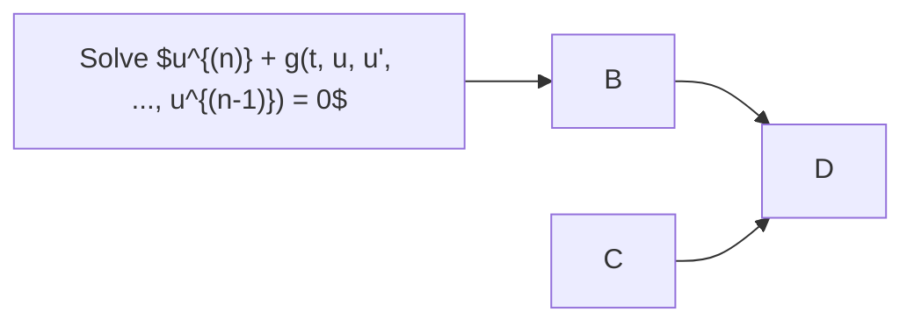

# integrodifferential: a Python solver for integro-differential equations
A Python-based solver for linear ordinary integro-differential equations.
## What is the purpose of this solver?
The aim of this project is to provide a user-friendly tool to numerically solve ordinary differential equations with memory taking the form

$$u^{(n)} + g(t, u, u', ..., u^{(n-1)}) + \int_0^{+\infty} k(t,s)F(u(s)) \mathrm{d} s = 0$$

endowed with suitable initial conditions. The code workflow is briefly described in the following diagram.

## Requirements and dependencies
The following requirements are necessary to run the solver:
- Python 3.12.3 or higher
- `numpy` version 2.2.3 or higher
- `scipy` version 1.16.0 or higher
- `matplotlib` version 3.10.3 or higher

The code can run on any OS that has Python installed.
> [!NOTE]
> The version references may not be mandatory, but are recommended since they match the dev testing environment.
## Installation and usage
1. Clone the GitHub repository.
2. Fill the script `main.py` following the instructions therein.
3. Run `main.py`.
## Test cases
The folder `test` contains several examples of ready-to-run scripts analyzing the Moore-Gibson-Thompson equation.
## References
[TODO]
## Authors
Andrea Di Primio (andrea.diprimio@polimi.it)  
Lorenzo Liverani (email)

